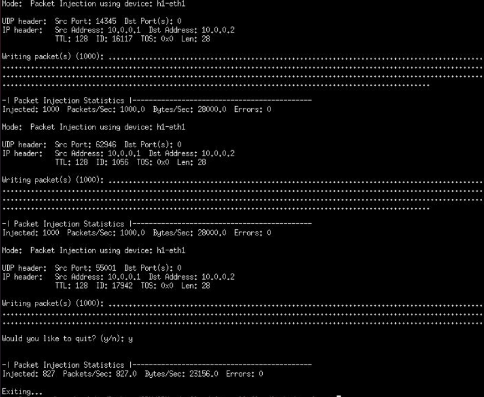
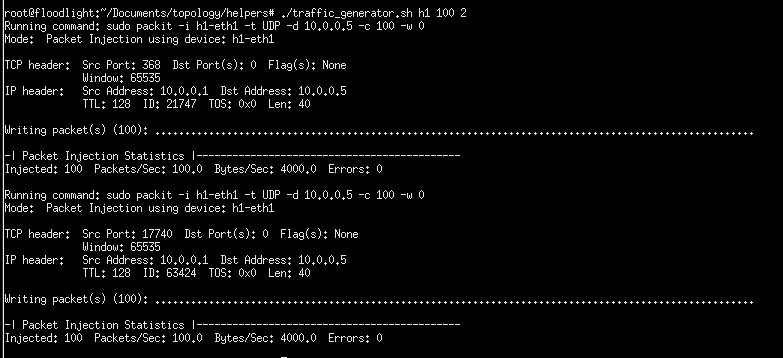

# SDN UDP Flood Firewall with Floodlight Controller

## Overview

This project implements a UDP flood firewall using the Floodlight controller, an open-source OpenFlow controller, in a Software Defined Network (SDN) environment. The goal is to mitigate UDP flood attacks by dynamically adjusting flow rules in response to network conditions. Based on the number of requests within a specific time frame, the system will block a user attempting a DDoS attack.

## Prerequisites

All required packets and files with needed version are located in ```topology/requirments.txt```

## Installation

To run project Linux distribution is needed. It can be chosen by the futere user but need to be compatible with all prerequisites.

## Configuration

In this topology, a central point is represented by a switch serving as the core. Connected to this switch are four PC terminals, comprising two "legitimate" hosts alongside two "malicious" hosts, intended to simulate attack scenarios. Additionally, the switch interfaces with a controller, while a server is also linked to the switch to complete the network setup.

## How to run it?

```sudo mn --custom path/to/topology/topology.py --topo mytopo```

## Topology:


## Traffic generation:

Within our topology, we simulate two distinct types of traffic. The first involves a typical WWW server setup, hosting various files of different sizes. PC1 and PC3 are configured to download these files, representing standard HTTP traffic. The second type of traffic consists of UDP packets generated by Packit, leading to the simulation of a UDP flood attack.

Before generating UPD flood attack you need to intall generator ```sudo apt install packit -y```. To perform attack bash script was made (we need to have continuous traffic from PCs). After executing, it generates following output in xterm of chosen host.



We add traffic generator in file [traffic_generator.sh](./topology/helpers/traffic_generator.sh) when we should give to input host, which send traffic and number of packets and times. 



## Algorithm pseudocode

```{java}
List<OFFlowStatsEntry> flowStats = getFlowStatistics(sw);
Map<Integer, int[]> historyFlows = new HashMap<>(); // key - flowId, value [ilość pakietów z poprzedniej iteracji, timestamp do obliczeń]
Map<String, Integer> blockedHosts = new HashMap<>(); // key - adres MAC/IP, value - timestamp kiedy został zablokowany

for (OFFlowStatsEntry flowStat : flowStats) {
    if (wartoscZakomentowana > THRESHOLD) { // (flowStat.getPacketCount().getValue(); - historyFlows[flowId][1]) / (actualTimestamp - historyFlows[flowId][2]) 
    	block(flowId);	// flowId = flowStat.getCookie().getValue()
    }
    
}

// metoda
block(flowId) {
    // match hosta po flowId po adresie MAC lub IP
    // dodawanie go na czarną listę na 60 sekund - każdy ruch z tego hosta jest odrzucany z tego
    // usuń wszystkie przepływy danego hosta
}

receivePacketIn() {
    // sprawdzenie czy dany pakiet przychodzi od hosta znajdującego się na czarnej liście - jeśli tak
    	// sprawdź czy został zablokowany > 60 sekund temu - jeśli tak
    		// odblokuj i zaakeptuj ruch
    	// jeśli nie
    		// dalej blokuj
    // jeśli nie
    	// zaakceptuj ruch
}
```

## Usefull links:

- [Floodlight OpenFlow Controller (OSS)](https://github.com/floodlight/floodlight#floodlight-openflow-controller-oss)
- [packit](https://linux.die.net/man/8/packit)
- [mininet](http://mininet.org/)

## Literature:

- [**DOS Attack Mitigation Strategies on SDN Controller**](https://ieeexplore.ieee.org/document/8666456) by Yun Tian, Vincent Tran, Mutalifu Kuerban (2019) presented at IEEE 9th Annual Computing and Communication Workshop and Conference (CCWC).
- [**Extending the Floodlight Controller**](https://ieeexplore.ieee.org/document/7371714) by Laura Victoria Morales, Andres Felipe Murillo, Sandra Julieta Rueda presented at the 2015 IEEE 14th International Symposium on Network Computing and Applications.
- [**SDN Controllers: A Comparative Study**](https://ieeexplore.ieee.org/document/7495430 by Ola Salman, Imad H. Elhajj, Ayman Kayssi, Ali Chehab, presented at the 2016 18th Mediterranean Electrotechnical Conference (MELECON), published by IEEE.)
- [**Early Detection of Distributed Denial of Service Attack in Era of Software-Defined Network**](https://ieeexplore.ieee.org/document/8530546) by Bineet Kumar Joshi, Nitin Joshi, Mahesh Chandra Joshi, presented at the 2018 Eleventh International Conference on Contemporary Computing (IC3), published by IEEE.)
- [**Early Detection of DDoS Attacks Against SDN Controllers**](https://ieeexplore.ieee.org/document/7069319) by Seyed Mohammad Mousavi, Marc St-Hilaire, presented at the 2015 International Conference on Computing, Networking, and Communications (ICNC), published by IEEE.)
